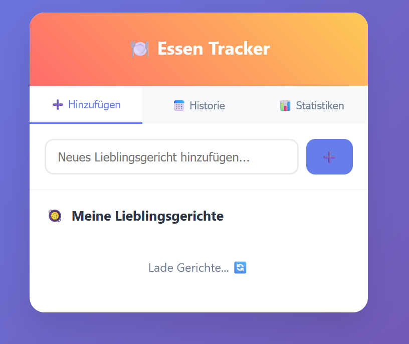
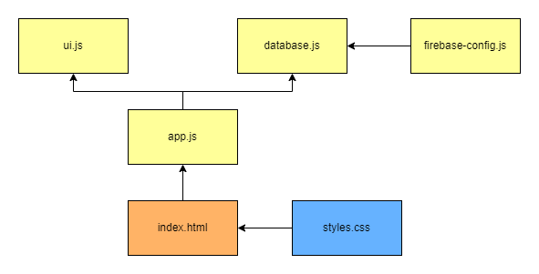

# NutritionTracker

A simple web app for tracking all my meals with Firebase backend.




## Usage

1. **Add dishes**: Enter your favorite meals
2. **Track**: Click "✓" when you've eaten something
3. **History**: Browse through past days
4. **Export**: Download all data as CSV

## Tech Stack

- **Frontend**: HTML, CSS, JavaScript (ES6 Modules)
- **Backend**: Firebase Firestore
- **Hosting**: Firebase Hosting
- **Design**: Responsive, Mobile-First

## Project Structure

```
NutritionTracker/
├── public/
│   ├── css/
│   │   └── styles.css
│   ├── js/
│   │   ├── app.js
│   │   ├── components/
│   │   │   └── ui.js
│   │   ├── services/
│   │   │   └── database.js
│   │   └── config/
│   │       └── firebase-config.js
│   └── index.html
├── firebase-hosting-manual.md
└── README.md
```